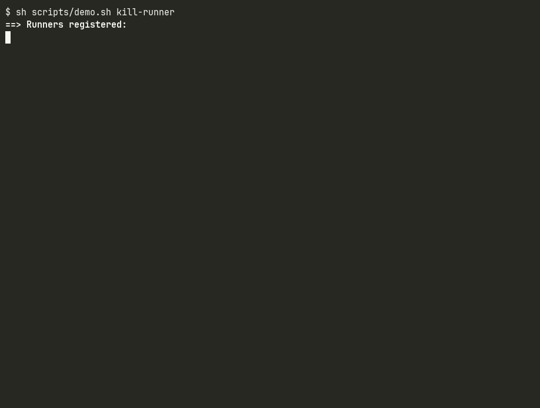
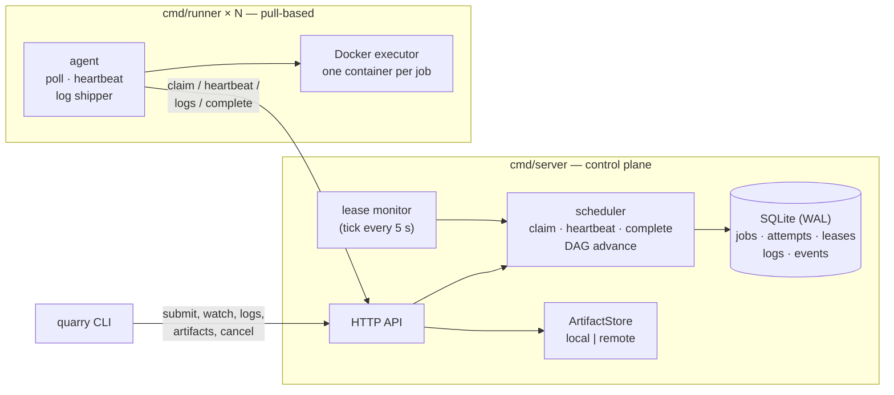

# Quarry

[](https://github.com/manavmann/distributed-ci-cd-platform/actions/workflows/ci.yml)

A distributed CI/CD platform in Go. A control plane turns a `.quarry.yml`
pipeline into a DAG and hands its jobs to a fleet of pull-based runners
that execute each one in its own Docker container. Scheduling is
lease-based, so a runner can be SIGKILLed mid-job and the job still
finishes — on another runner, exactly once — and the control plane can
restart mid-run without losing anything. Standard library plus five
dependencies; everything else is hand-written because it *is* the
project.



What the recording shows (`scripts/demo.sh kill-runner`, lease TTL 10 s):
a four-job pipeline starts, the runner executing `build` is killed with
SIGKILL while its container is still running, the lease expires, the
monitor requeues the job with `failure_kind: lost_runner`, a different
runner claims attempt 2 and the run succeeds. The killed runner is then
started again and reaps the container it left behind.

## What is in the box

- **DAG pipelines** — `needs:` edges, parallel fan-out, cycle detection,
  dependents skipped when a job fails.
- **Lease-based scheduling** — runners claim jobs in one atomic SQLite
  transaction, renew a lease with every heartbeat, and lose it when they go
  silent. Every runner-side write is fenced on `(state='running', attempt)`,
  so a zombie that comes back cannot overwrite the attempt that replaced it.
- **Failure model that is tested, not asserted** — runner crash, control
  plane restart, network partition on either side, cancel mid-flight,
  timeout, duplicate delivery, concurrent claims, a 50-job stress run with
  two runners hard-killed. Every row of [docs/failure-model.md](docs/failure-model.md)
  cites the test that exercises it.
- **Isolated execution** — one container per job with a fresh volume per
  attempt; job containers never see the Docker socket and are never
  privileged. Logs are attached before the container starts and shipped in
  ordered, deduplicated batches; artifacts go to a local or a replicated
  remote object store.
- **A CLI that does the job** — `run`, `watch`, `logs -f`, `events`,
  `cancel`, `artifacts --download`, `runners`; every command reconnects
  through transient network errors.
- **Observability** — Prometheus metrics on both binaries, structured JSON
  logs with `run_id/job_id/attempt` on every attempt line, and an event log
  per run that is the audit trail.

## Try it in five minutes

Needs Docker with compose v2 and Go 1.27 — nothing else is installed.

```sh
git clone https://github.com/manavmann/distributed-ci-cd-platform.git
cd distributed-ci-cd-platform
scripts/demo.sh                 # build the CLI, start 1 server + 3 runners, run examples/go-app
scripts/demo.sh kill-runner     # the recording above: SIGKILL a runner mid-job
scripts/demo.sh restart-server  # restart the control plane mid-run; nothing is re-run
scripts/demo.sh cancel          # cancel a run while a container is executing
scripts/demo.sh down            # tear the cluster down (down -v also drops its volume)
```

The default beat brings up [deploy/docker-compose.yml](deploy/docker-compose.yml)
(one server on a named volume, three labeled runners that run job
containers as siblings on your Docker daemon), submits
[examples/go-app](examples/go-app) — `build` → `test` + `lint` → `package`,
which publishes `dist/go-app` as an artifact — and watches it finish. CI
runs the default and `kill-runner` beats on every push and asserts a cold
run finishes in under two minutes. Each beat checks its own claim and
exits non-zero if the cluster did not behave: `kill-runner` verifies attempt
2 ran on a different runner and that a `job.requeued`/`lost_runner` event
exists; `restart-server` verifies attempt 1 finished and nothing was
requeued.

`scripts/demo.sh remote` runs the same pipeline with artifacts stored in a
replicated object store (compose profile `remote`; needs access to its
image, or `QUARRY_STORAGE_IMAGE` pointing at one you built) and downloads
them back out. `scripts/record-demo.sh` re-records the GIF.

The same thing by hand:

```sh
docker compose -f deploy/docker-compose.yml build server runner-1  # each image once (see below)
docker compose -f deploy/docker-compose.yml up -d --wait
export QUARRY_TOKEN=dev-token            # QUARRY_API_TOKEN in the compose env
go build -o bin/quarry ./cmd/quarry
bin/quarry run --wait -C examples/go-app  # prints the run id, then the job table
bin/quarry runners                        # runner-1..3, online, labels
```

Port 8080 taken? `QUARRY_PORT=18080 scripts/demo.sh` (the CLI follows it). Why
`build` before `up` rather than `up --build`: the three runners share one
image tag, and recent Compose builds them in parallel through bake, so on a
cold cache two of the three fail with `image quarry-runner:dev already
exists`; building `server` and `runner-1` first sidesteps it.

## How it works



A run's life: `quarry run` bundles the workspace and posts the pipeline;
the server parses it, builds the DAG and queues the roots. Idle runners
poll `claim` once a second; a claim is one transaction that matches labels
and capacity, marks the job `running`, records `(runner, attempt)` and
grants a lease. The runner creates a volume and a container, attaches to
its output before starting it, ships log chunks in batches and heartbeats
every 5 s to extend the lease — the heartbeat reply is also how the server
delivers `cancel` and `abort`. `complete` carries the exit code and
artifacts and advances the DAG in the same transaction.

If heartbeats stop, the monitor's next tick finds the expired lease and
requeues the job with the attempt number bumped (up to `max_attempts`, 3
by default), or fails it as `lost_runner`. Should the old runner reappear,
its next write fails the `(state='running', attempt)` fence and it aborts
silently. A control-plane restart changes none of this: state is in
SQLite, runners reconnect for as long as they live, and expiry is deferred
for one lease TTL after startup so nothing is requeued just because the
server was away.

The long form, with sequence diagrams and the job state machine:
[docs/architecture.md](docs/architecture.md),
[docs/protocol.md](docs/protocol.md). The fifteen decisions behind it
(Docker-out-of-Docker, SQLite single writer, fencing over locks, tick over
timers, …): [docs/design-decisions.md](docs/design-decisions.md).

## What breaks, and what happens

| what breaks | what happens | proven by |
|---|---|---|
| runner SIGKILLed mid-job | lease expires after `QUARRY_LEASE_TTL` (30 s); job requeued as `lost_runner`; attempt 2 on another runner | [`TestLostRunnerJobIsReassigned`](internal/harness/lease_test.go), [`TestTickRequeuesExpiredLeaseAndFencesTheOldAttempt`](internal/scheduler/monitor_test.go) |
| the dead runner comes back | its heartbeat gets `abort`; late `complete`/logs/artifacts get 409; the newer attempt's result stands | [`TestZombieRunnerAbortsSupersededAttempt`](internal/harness/lease_test.go), [`TestCompleteStaleAttemptIsFenced`](internal/scheduler/scheduler_test.go) |
| control plane restarts mid-run | jobs, attempts and leases survive in SQLite; runners reconnect; expiry deferred one TTL | [`TestServerRestartMidRun`](internal/harness/restart_test.go), [`TestServerRestartAfterLeaseTTL`](internal/harness/restart_test.go) |
| two runners claim at the same instant | exactly one `UPDATE … WHERE state='queued'` wins | [`TestClaimConcurrentExactlyOneWins`](internal/scheduler/scheduler_test.go), [`TestEachJobExecutedOnceUnderContention`](internal/harness/harness_test.go) |
| `quarry cancel` while a container runs | unstarted jobs cancelled at once; the running one killed on its next heartbeat | [`TestCancelPropagatesWithinOneHeartbeat`](internal/harness/cancel_test.go) |
| a step outruns its `timeout` | container killed, `failed (timeout)`, never retried; the monitor backstops a runner that fails to enforce it | [`TestJobTimeoutIsEnforcedByRunner`](internal/harness/cancel_test.go), [`TestTimeoutBackstopCancelsThroughHeartbeat`](internal/harness/cancel_test.go) |
| network loss between runner and server | claim, heartbeat, logs and `complete` retry with capped backoff for as long as the runner is alive | [`TestAgentConnectionBackoff`](internal/agent/agent_test.go), [`TestAgentShutdownDuringOutage`](internal/agent/agent_test.go) |
| a `complete` is delivered twice | the second is a 200 no-op; the first result stands | [`TestCompleteDuplicateIsNoop`](internal/scheduler/scheduler_test.go) |
| 50-job fan-out on 3 runners, two of them hard-killed mid-run | every job succeeds within 3 attempts; no `(job, attempt)` executes twice | [`TestStressFanOutFanInWithRunnerLoss`](internal/harness/stress_test.go) |

The full table — 30-odd scenarios including OOM, log caps, artifact
store outages and CLI reconnects — is
[docs/failure-model.md](docs/failure-model.md). Two rows there are marked
**no test**; they are listed rather than hidden.

## Numbers

From [docs/benchmarks.md](docs/benchmarks.md), each reproducible with a
script under [scripts/bench/](scripts/bench/) (Ryzen 5 3600X, Docker
Desktop, HDD; medians of three):

| | |
|---|---|
| scheduling overhead | 650–750 claims/s regardless of runner count; queued→running p50 is the 1 s poll interval, p95 within 70 ms of it |
| throughput | 218 jobs/min on 3 Docker runners at capacity 2, ~1.4 s of Docker per job |
| log ingestion | 15.3 MB/s, 272 chunks/s stored, at ~98 % of one server core |
| runner-loss recovery | lease TTL + ~2 s: 12.6 s at a 10 s TTL, 31.6 s at 30 s |

## The CLI

`quarry` talks to a control plane over HTTP. Point it at the server with
`QUARRY_SERVER` (default `http://127.0.0.1:8080`) and authenticate with
`QUARRY_TOKEN`; `--server` / `--token` override either.

```
quarry run [--wait] [-C dir] [-f file]   bundle the workspace (.git excluded), submit
                                         <dir>/.quarry.yml, print the run id
quarry runs [-n 20]                      list recent runs
quarry status <run>                      show a run and its jobs once
quarry watch <run>                       redraw the job table (state, attempt, runner, duration)
                                         in DAG order until the run finishes; exit 1 unless succeeded
quarry logs <job> [-f] [--attempt N]     print a job's log; -f follows until it is drained
quarry events <run> [-f]                 print a run's events
quarry artifacts <job> [--download dir]  list a job's artifacts (path, size, sha256) or fetch them
quarry runners                           list registered runners
quarry cancel <run>                      cancel a run
```

`--interval` sets the poll period for `watch`, `--wait` and `-f` (default 1s).

## Pipelines

```yaml
name: go-app
jobs:
  - name: build
    image: golang:1.27-alpine
    labels: { os: linux }          # only runners with matching labels claim it
    steps:
      - go build ./...
  - name: test
    image: golang:1.27-alpine
    needs: [build]                 # DAG edge; siblings run in parallel
    timeout: 10m
    steps:
      - go test ./...
  - name: package
    image: golang:1.27-alpine
    needs: [test]
    env: { CGO_ENABLED: "0" }
    resources: { cpu: 1, memory: 512m }
    steps:
      - go build -o dist/go-app .
    artifacts: [dist]              # uploaded when the job succeeds
```

Each job runs its steps as one generated `run.sh` in a fresh container
against a copy of the submitted workspace; `QUARRY_RUN`, `QUARRY_JOB`,
`QUARRY_ATTEMPT` and `CI` are set inside it.

## Building and testing

```sh
make build         # bin/server, bin/runner, bin/quarry (version stamped via ldflags)
make test          # unit + in-process harness suites, -race
make test-docker   # the real executor and the remote artifact store (build tag docker)
make lint          # gofmt + go vet
```

`internal/harness` starts a real server and N in-process runners with a
fake executor and a fake clock on a temp database, with fault injection
(muted heartbeats, hard-killed runners, a stoppable server, scripted job
outcomes, failing artifact puts), so almost every scenario above runs
in milliseconds and deterministically. Timing rules that keep it that way:
no `time.Sleep` in tests, no `time.Now()` in the scheduler, timestamps
are Unix milliseconds generated in Go.

## Layout

| | |
|---|---|
| `cmd/server`, `cmd/runner`, `cmd/quarry` | the three binaries |
| `internal/pipeline` | `.quarry.yml` parsing, validation, DAG |
| `internal/store` | SQLite schema, migrations; every write goes through here |
| `internal/scheduler` | claim, heartbeat leases, fenced completion, DAG advancement, lease monitor |
| `internal/api` | user endpoints and the `/api/runner/*` protocol |
| `internal/agent`, `internal/executor`, `internal/logship` | the runner: poll loop, Docker/fake executors, log shipper |
| `internal/artifact` | `ArtifactStore` with `local/` and `remote/` backends |
| `internal/cli`, `internal/harness`, `internal/metrics` | CLI, test harness, Prometheus registries |
| `deploy/` | compose cluster with `remote` and `prometheus` profiles |
| `docs/` | [architecture](docs/architecture.md) · [protocol](docs/protocol.md) · [failure model](docs/failure-model.md) · [design decisions](docs/design-decisions.md) · [benchmarks](docs/benchmarks.md) |

Built with Go and five dependencies: `modernc.org/sqlite`, the Docker
Engine SDK, `gopkg.in/yaml.v3`, `prometheus/client_golang` and
`spf13/cobra`.
