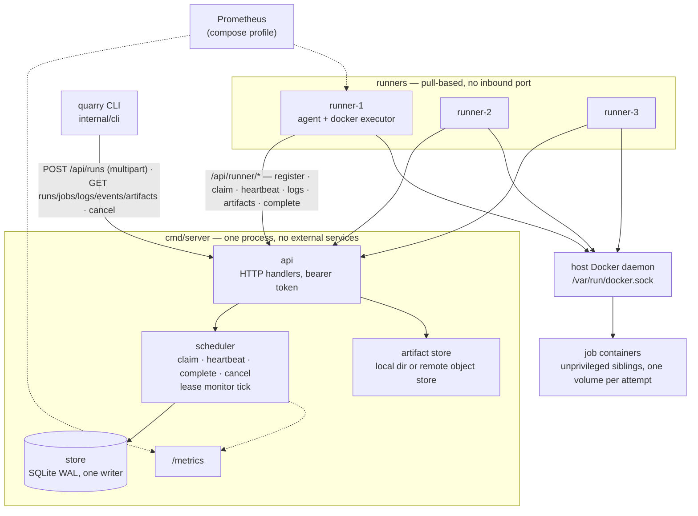

# Architecture

`docs/protocol.md` is the precise runner protocol and scheduling rules,
`docs/failure-model.md` says what breaks and which test proves the
recovery, `docs/design-decisions.md` says why it is built this way, and
`docs/benchmarks.md` says how fast it is. This document is the map.

## Components

- **`cmd/server`** — the control plane, one process, no external
  services. Owns the SQLite database (`internal/store`), the scheduler
  and its lease monitor (`internal/scheduler`), the HTTP API
  (`internal/api`) and the artifact store (`internal/artifact`: the
  `local` backend by default, or `remote` — a replicated object store's
  coordinator — with `QUARRY_ARTIFACT_BACKEND=remote`).
- **`cmd/runner`** — a stateless agent (`internal/agent`). On start it
  reaps any container or volume labelled with its own name that an
  earlier incarnation left behind, registers by name, then polls `claim`
  while below capacity, runs each attempt through an `Executor`
  (`internal/executor/docker`, or the fake for tests), heartbeats, ships
  logs (`internal/logship`), uploads artifacts and reports completion. It
  never links `store` or `api`.
- **`cmd/quarry`** — the cobra CLI (`internal/cli`). Bundles a workspace,
  submits `.quarry.yml`, watches, reads logs/events/artifacts, cancels.

Runners are *pull-based*: the server never connects to a runner, so
runners need no inbound port and can sit behind NAT. Adding capacity is
starting another runner process with the same token.

## Life of a run

1. `quarry run` tars the workspace (`.git` excluded, symlinks not
   followed) and POSTs it with the pipeline as multipart to
   `POST /api/runs`. The server mints the run id, streams the bundle to
   `sources/<run>.tar` in the artifact store, parses and validates the
   YAML (`internal/pipeline`: unknown fields rejected, cycles named) and
   in **one transaction** inserts the run, its jobs (roots `queued`, the
   rest `pending`, every job stamped with `max_attempts`), their edges
   and a `run.created` event.
2. A runner's `claim` picks the oldest `queued` job whose labels are a
   subset of its own and flips it to `running` with `attempt+1` and a
   lease, guarded by `state='queued'` so two runners cannot take it.
3. The Docker executor creates a volume `quarry-<job>-<attempt>` at
   `/workspace`, copies the source bundle and a generated `run.sh` into
   the container, attaches, then starts it. Output streams through the
   log shipper in 250 ms / 64 KiB batches; the heartbeat goroutine
   extends the lease every 5 s and obeys `abort`/`cancel`. A job
   `timeout` is a deadline on the executor's context.
4. On exit the executor copies declared `artifacts:` out of the
   container; the agent uploads them, flushes the last logs, then sends
   `complete`. The server fences the write on `(running, attempt)`,
   applies the terminal state (or requeues an `infra` failure below
   `max_attempts`, default 3), advances the DAG (`pending` → `queued` or
   `skipped`) and finalises the run — all in one transaction, so a
   dependent is queued exactly once.
5. `quarry watch` polls `GET /api/runs/{id}` and redraws the job table in
   DAG order until the run is terminal; `quarry cancel` asks the server
   to cancel, and every running attempt is told on its next heartbeat.

If a runner dies mid-job its heartbeats stop; the lease monitor (a 5 s
tick on the server, fake clock in tests) requeues the job once the lease
is 30 s stale and another runner picks it up as the next attempt. The
dead runner's late writes fail the `(running, attempt)` fence. If the
*server* restarts, nothing is requeued for one full lease TTL after boot
so live runners can renew leases that expired during the outage. See
`docs/failure-model.md` for every such case and the test behind it.

## Where state lives

| what                       | where                                                      |
|----------------------------|------------------------------------------------------------|
| runs, jobs, deps, runners  | SQLite tables (`internal/store/migrations`)                |
| events (`quarry events`)   | `events` table, append-only                                |
| logs                       | `log_chunks (job_id, attempt, seq)`, capped per attempt    |
| artifacts + source bundles | `ArtifactStore` (`runs/<run>/jobs/…`, `sources/<run>.tar`) — a local directory or the remote object store |
| cancel requests            | `jobs.cancel_requested_at / cancel_reason`, delivered on the next heartbeat |
| runner working state       | nowhere — a restarted runner re-registers under the same name and gets the same `runner_id` |
| monitor state              | nowhere — the startup grace deadline is recomputed from the clock on every boot |

Every write to a job by a runner is fenced on `(state='running',
attempt)`; every state transition is one store transaction; timestamps
are Unix milliseconds generated in Go from an injected clock. See
`CLAUDE.md` for the full invariant list and `docs/design-decisions.md`
for why.

## Deployment shape

`deploy/docker-compose.yml` is the reference cluster: the server with a
named `quarry-data` volume (database + artifacts) and three labeled
runners sharing the host Docker daemon. The runner image runs as root to
open the socket; job containers are ordinary unprivileged siblings on
the host daemon (Docker-out-of-Docker). A runner's healthcheck is "has
it registered with the server", so `docker compose up --wait` returns
only when the fleet can take work.

Two optional profiles: `remote` adds the replicated object store
(coordinator + 3 nodes, RF=3) and points the server at it; `prometheus`
adds a Prometheus scraping the server and every runner. `scripts/bench/`
drives the same cluster for the numbers in `docs/benchmarks.md`.

## Observability

Both binaries log one JSON line per event through `log/slog` with a
`component` field (`server` or `runner`). A line carries the identifiers
in scope where it is written: `request_id` on failed API requests,
`runner_id` on every runner line after registration, and `run_id`,
`job_id`, `attempt` on every line inside an attempt. The events table
remains the domain-level trace; logs are for the process, not the run.

The server serves Prometheus metrics at `GET /metrics` (no token, like
`/healthz`), updated by the scheduler after each committed transaction:

| series                           | kind      | meaning                                        |
|----------------------------------|-----------|------------------------------------------------|
| `quarry_jobs_total{state}`       | counter   | job transitions by the state entered           |
| `quarry_queue_depth{labels}`     | gauge     | queued jobs by required labels, read at scrape |
| `quarry_job_duration_seconds`    | histogram | claim → terminal result, per attempt           |
| `quarry_claim_latency_seconds`   | histogram | queued → running                               |
| `quarry_lease_expirations_total` | counter   | leases the monitor found expired               |
| `quarry_runners{state}`          | gauge     | runners by state, read at scrape               |
| `quarry_log_bytes_total`         | counter   | log bytes stored, after the per-attempt cap    |

A runner exposes `quarry_runner_active_jobs` and
`quarry_runner_executor_errors_total` on `QUARRY_METRICS_LISTEN` when set
(compose sets `:9100`). The compose `prometheus` profile scrapes all four
every 5 s from `deploy/prometheus.yml`; there is no Grafana and no tracing.

## Not yet

Artifact retention and GC, `web/`, control-plane HA, a `quarry` CLI
image. Known gaps per commit are tracked in `docs/progress.md`.
