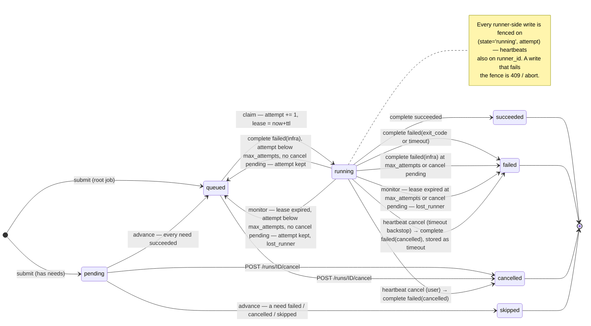
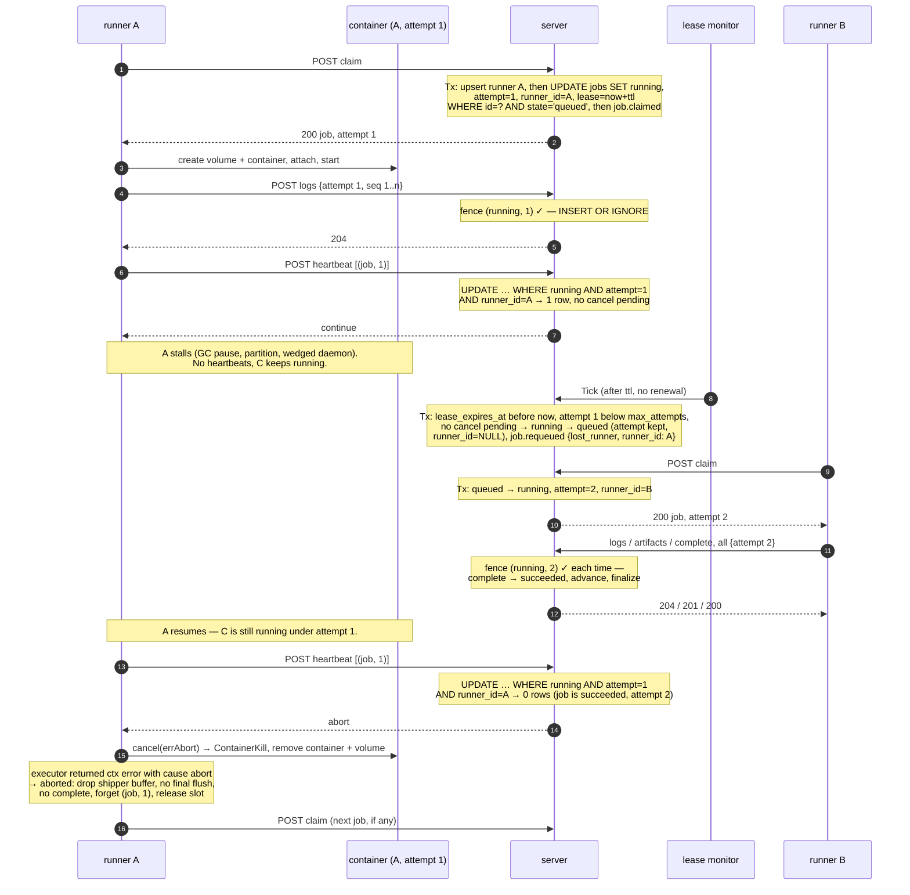
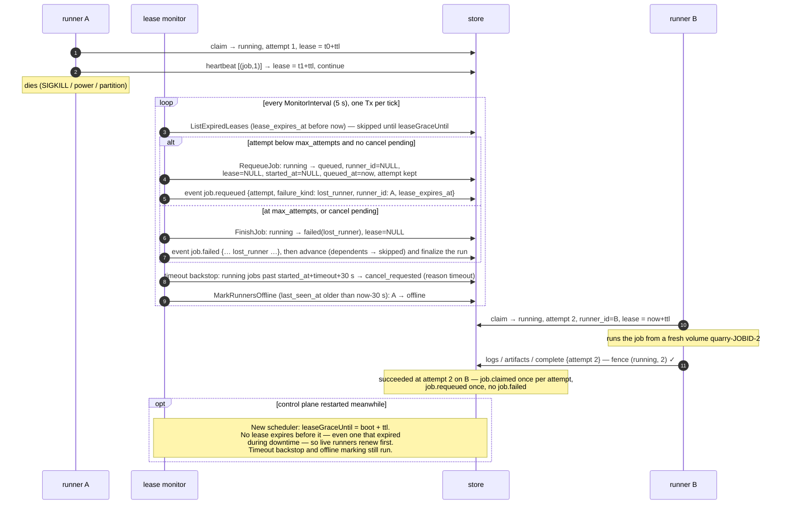

# Runner protocol

How a runner talks to the control plane, and the exact rules the
scheduler applies. Blueprint §8/§13/§14 are the source; this document is
what `internal/scheduler` (server side) and `internal/agent` (runner
side) implement and what their tests check. Where the text and the code
disagree, the code is wrong or this document is — file it either way.

## Job states

`queued` means the job is claimable. `attempt` starts at 0 and is
incremented by every successful claim, never reset, so attempt `n` is the
n-th runner to hold the job. A retry keeps the attempt number until the
next claim bumps it: attempts count claims, not failures. A job is
terminal in `succeeded`, `failed`, `cancelled` or `skipped`.



Edges out of `running` are the whole retry story: only `infra` (reported
by the runner) and `lost_runner` (decided by the monitor) go back to
`queued`, and only below `max_attempts` with no cancel pending. Both
`running → queued` edges keep the attempt number; the next claim
increments it, which is what fences the previous holder out.

## Endpoints

All `/api/runner/*` endpoints take the same bearer token as the user API.
Bodies are JSON, at most 64 KiB except `logs` (1 MiB) and artifact
uploads (raw, 1 GiB). Timestamps are Unix milliseconds.

### `POST /api/runner/register`

```json
{"name": "box-a", "labels": {"os": "linux"}, "capacity": 2}
```

Resolves a runner name to its `runner_id`, minting one on first sight.
Names are unique (`runners.name`, migration 0002); re-registering the
same name is idempotent — the reply carries the same `runner_id` and the
row's labels and capacity are refreshed (version comes from claim). The
lookup and upsert share one transaction. A runner calls this once at
startup, before its first claim, and retries transport errors and 5xx
replies with capped backoff (a control plane that is still starting just
delays it); a 4xx is fatal.

Responses: `200 {"runner_id": "…"}`, `400` when `name` is empty or
`capacity` is negative.

### `POST /api/runner/claim`

```json
{"runner_id": "r1", "name": "r1", "labels": {"os": "linux"}, "capacity": 2, "version": "dev"}
```

Everything below is one `BEGIN IMMEDIATE` transaction
(`scheduler.Claim`):

1. upsert the runner row (labels, capacity, version, `last_seen_at=now`,
   state `online`);
2. select `queued` jobs ordered by `queued_at, rowid`;
3. walk them in order and take the first whose spec labels ⊆ runner
   labels (matched in Go);
4. `UPDATE jobs SET state='running', runner_id=?, attempt=attempt+1,
   lease_expires_at=now+ttl, started_at=now WHERE id=? AND state='queued'`
   — `0 rows` means someone else took it and the walk continues;
5. if the run was `pending`, mark it `running` (`run.started`); append
   `job.claimed {runner_id, attempt}`.

Responses: `200` with the job and its new attempt, or `204` when nothing
matched. A runner polls this every ~1 s (±25 % jitter) while it has a
free capacity slot; a successful claim is followed by another poll at
once. Claiming is also how an idle runner stays `online`: a runner with
nothing running does not heartbeat.

```json
{"job": {"id": "…", "run_id": "…", "name": "test", "attempt": 1,
         "lease_expires_at": 1700000030000, "lease_ttl_ms": 30000, "spec": {…}}}
```

### `POST /api/runner/heartbeat`

```json
{"runner_id": "r1", "jobs": [{"job_id": "…", "attempt": 1}]}
```

One transaction: refresh the runner's `last_seen_at` (and set it
`online`; an unknown runner is upserted with name = id and no labels),
then for each listed job, in order:

```sql
UPDATE jobs SET lease_expires_at = now+ttl
 WHERE id=? AND state='running' AND attempt=? AND runner_id=?
```

The directive depends on that update alone:

| rows | then                             | directive  |
|------|----------------------------------|------------|
| 0    | —                                | `abort`    |
| 1    | `cancel_requested_at IS NULL`    | `continue` |
| 1    | `cancel_requested_at` set        | `cancel`   |

| directive  | runner reaction                                                        |
|------------|------------------------------------------------------------------------|
| `continue` | lease extended, keep going                                             |
| `cancel`   | lease extended, but a cancel is pending (user cancel or timeout backstop). Kill the container, report `failed(cancelled)` — this attempt is still the live one and its verdict counts |
| `abort`    | the fence failed — the job is unknown, not running, requeued, or the attempt is not yours any more. Kill the container, report nothing |

The runner heartbeats every 5 s carrying every attempt it currently
holds; the heartbeat goroutine outlives the poll loop so attempts still
draining after shutdown keep their leases.

### `POST /api/runner/jobs/{id}/complete`

```json
{"runner_id": "r1", "attempt": 1, "status": "failed",
 "failure_kind": "exit_code", "exit_code": 2, "error": "…"}
```

`status` is `succeeded` or `failed`; `failure_kind` is one of
`exit_code | timeout | infra | cancelled` and is required when failed
(`lost_runner` is the monitor's, a runner sending it gets `400`).
Everything below happens in **one transaction**, in this order
(`scheduler.Complete`):

1. **Fence.** Load the job. If `state='running' AND attempt=?` does not
   hold:
   - job already terminal with the same attempt → `200`, no-op
     (duplicate delivery; the first result stands);
   - otherwise → `409` (stale attempt, requeued job, unknown attempt).
   The runner treats 409 as *abort* and does not retry it.
2. **Terminal transition**, the first matching case:
   - `succeeded` → `succeeded` (event `job.succeeded`);
   - `failed(cancelled)` → who asked decides the record: `cancel_reason =
     user` → job `cancelled` (event `job.cancelled`); `cancel_reason =
     timeout` (the monitor's backstop) → `failed(timeout)` (event
     `job.failed`);
   - `failed(infra)` **and** `attempt < max_attempts` **and**
     `cancel_requested_at IS NULL` → back to `queued` at the queue tail:
     `runner_id=NULL, lease_expires_at=NULL, started_at=NULL,
     queued_at=now`, attempt unchanged (event `job.requeued {attempt,
     failure_kind, error}`);
   - anything else → `failed` with the kind and exit code (event
     `job.failed`).
   Every one of these `UPDATE`s repeats the `state='running' AND
   attempt=?` guard.
3. **Advancement.** For every `pending` job of the run, until nothing
   changes: any need in `failed | cancelled | skipped` → `skipped`
   (`job.skipped`, decided even while other needs are in flight); else
   all needs `succeeded` → `queued` (`job.queued`). Each update is
   guarded by `state='pending'`, so a dependent is queued exactly once.
4. **Run finalization.** If no job is `pending | queued | running` the run
   is terminal: `failed` if any job failed, else `cancelled` if any job
   was cancelled, else `succeeded`. Event `run.finished {state}`.

Responses: `200` with the job as stored, `404` unknown job, `409` fence
failure, `400` bad body or an invalid status/kind.

The runner sends `complete` after its artifact uploads and after its
final log flush, with the delivery context (not the attempt's): a
transport failure waits with capped backoff for as long as the runner is
alive, a 5xx consumes one of 8 tries, a 409 or other 4xx is final.

### `POST /api/runner/jobs/{id}/logs`

```json
{"runner_id": "r1", "attempt": 1,
 "chunks": [{"seq": 7, "data": "<base64>"}, {"seq": 8, "data": "<base64>"}]}
```

Ships a batch of log chunks for one attempt. `seq` is assigned by the
runner, 1-based and gapless per attempt; `data` is raw bytes, base64 in
JSON. The body may be up to 1 MiB. In one transaction
(`scheduler.AppendLogs`):

1. **Fence.** `state='running' AND attempt=?` must hold, else `409`.
   Unlike `complete`, a chunk for a finished attempt is *not* a no-op:
   the runner flushes its shipper before it sends `complete`, so a chunk
   arriving after that is a bug or a superseded attempt either way.
2. **Store.** `INSERT OR IGNORE` on `log_chunks(job_id, attempt, seq)`:
   a redelivered batch (same seqs, same bytes) changes nothing, and
   out-of-order batches read back in `seq` order.
3. **Cap.** An attempt keeps at most `QUARRY_LOG_CAP` bytes (default
   10 MiB). The chunk that crosses the cap is cut to fit, later chunks
   are stored empty (their seq is kept so redelivery still dedups), and
   `job.logs_truncated {attempt, cap_bytes}` is recorded once.

Responses: `204`, `409` fence failure, `404` unknown job, `400` bad body
or `seq < 1`.

The runner's shipper (`internal/logship`) buffers the executor's output
and flushes every 250 ms or at 64 KiB, whichever comes first; a chunk's
seq is assigned once when it is sealed, so a retried POST carries the
identical payload. On `409` it drops its buffer and signals `OnStale`,
which cancels the attempt with the abort cause — exactly as a heartbeat
`abort` would. Before `complete` the runner closes the shipper and waits
for its final flush, so `complete` never overtakes the last chunk; a
`409` met by that final flush is treated as a late answer about a
finished execution, not as an abort (see the note under the zombie
diagram).

### `GET /api/jobs/{id}/logs?after=N&attempt=A`

User endpoint, same token. Returns the chunks of attempt `A` (default:
the job's current attempt) with `seq > N` (default 0, i.e. everything) in
`seq` order:

```json
{"attempt": 1, "chunks": [{"seq": 3, "data": "<base64>"}], "next": 3}
```

`next` is the last `seq` returned, or the `after` that was asked for when
nothing was; clients pass it straight back as the next `after=`. The
cursor is strictly greater-than: `after=N` never returns chunk `N` again.

### `POST /api/runner/jobs/{id}/attempts/{attempt}/artifacts/{path}`

The request body is one artifact file, raw; `Content-Length` is required
(`411` without it) and bounded at 1 GiB (`413`); `Content-Type` is
recorded (default `application/octet-stream`). `{path}` is the file's
slash-relative name under the attempt (`dist/app.bin`) and must be a
plain relative path: no empty, `.` or `..` segments, no backslash or
control characters (`400`). The server is the only writer to the
artifact store:

1. **Fence.** `state='running' AND attempt=?` must hold (read outside a
   transaction), else `409` — checked before anything is written so a
   stale runner cannot fill the store.
2. **Stream.** The body goes straight through to `ArtifactStore.Put`
   under `runs/<run>/jobs/<job>/<attempt>/<path>`, hashed as it passes;
   nothing is buffered whole. A store failure is `500` and the runner
   retries.
3. **Record.** In one transaction the fence is checked again and the
   `artifacts(job_id, attempt, path, size_bytes, sha256, content_type,
   created_at)` row is upserted. A fence failure here deletes the object
   just written (`409`). The row exists only once the bytes do, never
   the other way round; a redelivered upload overwrites both.

Responses: `201 {"path", "size_bytes", "sha256", "content_type",
"created_at"}`, `409`, `404` unknown job, `400`, `411`, `413`.

The runner collects artifacts only after a zero exit: the executor copies
each declared path out of the container (`CopyFromContainer` returns a
tar rooted at the path's *parent*, so the leading `<basename>/` component
is stripped or `dist` would extract as `dist/dist/…`) into a per-attempt
directory, and the runner POSTs each regular file in it, one request per
file, in lexical order, before its final log flush and before `complete`.
The runner hashes the file as it streams it and compares the reply's
`sha256`/`size_bytes` with its own once the request is done: by then the
server has already stored the object and its row, so this detects a
mismatch after the upload completes, retries the whole upload, and fails
the attempt as infra if it persists. Transport errors and `5xx` are
likewise retried with the completion backoff; when the retries are
exhausted the attempt is reported `failed(infra)` — a job never succeeds
with artifacts missing. A `409` aborts the attempt like a stale log batch
would: nothing more is sent, not even `complete`. A declared path that
does not exist in the container is logged and skipped.

### `GET /api/jobs/{id}/artifacts?attempt=A`

User endpoint. Lists attempt `A`'s (default: current) artifact rows in
path order:

```json
{"attempt": 1, "artifacts": [{"path": "dist/app.bin", "size_bytes": 7,
 "sha256": "…", "content_type": "application/octet-stream", "created_at": 1700000000000}]}
```

### `GET /api/jobs/{id}/artifacts/{path}?attempt=A`

Streams one artifact from the store with the row's `Content-Length` and
`Content-Type`; the `sha256` is the `ETag`. `404` when the job, the
attempt's row or the object is missing. `quarry artifacts <job>
[--download dir] [--attempt N]` lists or downloads them; a download is
verified against the listed `sha256` and written under `dir/<path>`
(paths that would leave `dir` are refused).

### `GET /api/runs/{id}/source`

Streams the run's workspace bundle (`application/x-tar`) from
`sources/<run>.tar`, where `POST /api/runs` put the multipart `source`
part as it arrived. `404` when the run does not exist or was submitted
without a bundle; the Docker executor then runs the job in an empty
`/workspace`.

### `POST /api/runs/{id}/cancel` (user API)

Cancels a run, in one transaction (`scheduler.CancelRun`):

1. every `pending` or `queued` job → `cancelled` with
   `failure_kind=cancelled` (event `job.cancelled`) — it never runs;
2. every `running` job gets `cancel_requested_at=now, cancel_reason=user`
   (event `job.cancel_requested {attempt, runner_id, reason}`), unless a
   request is already pending (the first reason stands); its runner's
   next heartbeat answers `cancel`, the runner kills the container and
   reports `failed(cancelled)`, which `complete` records as a
   `cancelled` job;
3. event `run.cancel_requested`, then the usual advancement and
   finalization: the run is `cancelled` at once when nothing was running,
   otherwise it stays `running` until the last attempt reports.

A job with a cancel pending is never requeued, whatever it reports and
whether or not its lease expires. Responses: `202` with the run and jobs
as stored, `404` unknown run, `409` run already finished. Repeating the
call while attempts wind down is a no-op `202`.

**Timeout backstop.** The runner enforces each job's `timeout` through the
executor context and reports `failed(timeout)` itself. The lease monitor
additionally asks for a cancel (`cancel_reason=timeout`, event
`job.cancel_requested {reason: timeout, timeout_ms, started_at}`) for any
running job with no cancel pending whose `started_at + timeout + grace`
(grace 30 s) is in the past — a runner that somehow did not enforce the
timeout is told to kill the job on its next heartbeat, and its
`cancelled` report is recorded as `failed(timeout)`.

## Fencing rule

Every runner-side write — heartbeat, log chunk, artifact, completion —
checks `(state='running', attempt)`. Not attempt alone: between a lease
expiry (running → queued) and the next claim, the old attempt number is
still the latest, and the state check is what rejects the lost runner's
late write. Heartbeats additionally check `runner_id`, because a lease
extension is the one write that would otherwise let a zombie keep a
reassigned attempt alive. A runner that receives `409` or `abort` kills
its container and forgets the attempt.

## Runner abort path

A runner learns that an attempt is no longer its own in one of four ways,
and reacts the same way to all of them:

| signal                                   | when it arrives                                    |
|------------------------------------------|----------------------------------------------------|
| heartbeat directive `abort`              | within one heartbeat interval of the fence failing |
| `409` on `POST …/logs`                   | on the next log flush                              |
| `409` on `POST …/artifacts/{path}`       | when a finished attempt uploads its artifacts      |
| `409` on `POST …/complete`               | when a finished attempt reports its result         |

The reaction is *abort*: cancel the attempt's context with the abort
cause (the executor kills the container and removes it and its volume,
exactly as for a timeout), discard whatever the log shipper still holds,
send nothing more for the attempt — not even `complete` — forget the
`(job, attempt)` pair, and release the capacity slot so the runner can
claim again. The abort is not reported and not logged server-side: from
the control plane's point of view the attempt was already over when the
lease expired, and the runner is only catching up. The server never
learns that a zombie existed except through the `409`s it rejected.

Two things keep the abort path narrow (`agent.runAttempt`):

- The verdict is fixed the moment the executor returns and the artifact
  uploads are done: *aborted* means "the executor returned an error
  **and** the context's cause is abort". A `409` met by the final log
  flush therefore belongs to a finished execution: the flush is
  discarded, but `complete` is still sent, and the server answers *that*
  with its own `409` if the attempt is stale.
- An `abort` for an attempt the runner no longer holds (it finished and
  reported in the same heartbeat interval) is ignored: there is nothing
  to kill.

Cancellation (`cancel`) takes the same kill path but ends in a
`complete` with `failure_kind: cancelled`, because there the runner's
attempt is still the live one and its verdict counts.

## Sequence diagrams

Time flows down. `S` is the control plane, `A`/`B` are runners, `C` is a
job container, `M` is the lease monitor goroutine inside `S`. Heartbeats
not shown are `continue`.

### Runner protocol, with a fenced-off zombie attempt

The primary path: A claims, stalls past the lease TTL, the monitor
reassigns, B finishes attempt 2, then A resumes and is fenced out on its
first write. Every server-side step is one transaction.



The store now holds B's logs under attempt 2, B's artifact rows and
objects under attempt 2, and none of A's. The harness test
`TestZombieRunnerAbortsSupersededAttempt` runs exactly this with two
in-process agents and the fake clock.

Two variants share the same fence and end the same way:

- **A's container finishes before A's next heartbeat.** The executor
  returns normally, so the verdict is fixed as `succeeded`/`exit_code`
  and the abort cause (if a late heartbeat sets it) is *not* honoured.
  The final log flush hits the fence (`409` → `ErrStale`, ignored), then
  `complete {attempt 1}` is sent and answered `409`; the runner logs
  "result rejected, attempt superseded" and does not retry. Nothing of
  A's reaches the store because every write carried attempt 1.
  (`TestAgentLogs409AfterFinishDoesNotSuppressComplete`,
  `TestAgentFencedCompleteIsNotRetried`.)
- **A's container finishes and the job declares artifacts.** The first
  `POST …/artifacts/{path}` is fenced up front (`409`, nothing written);
  the upload error carries `errFenced`, the attempt is cancelled with the
  abort cause, and because the upload failure *is* an executor-side
  error the attempt is aborted: no final flush, no `complete`.
  (`TestAgentArtifactUpload409Aborts`.)

### Runner loss: lease expiry, reassignment and recovery

The monitor's view of the same failure, including the two branches at
the attempt cap and after a control-plane restart.



Reassignment latency with defaults is TTL (30 s) + up to one tick (5 s)
+ B's next poll (~1 s). The harness tests
`TestLostRunnerJobIsReassigned`, `TestLostRunnerExhaustsAttempts`,
`TestServerRestartAfterLeaseTTL` and the stress suite
`TestStressFanOutFanInWithRunnerLoss` drive this with the fake clock;
`scripts/bench/runner-loss.sh` measures it on the compose cluster
(`docs/benchmarks.md`: TTL + ~2 s).

## Retries

- `max_attempts` bounds the number of claims. Only `infra` and
  `lost_runner` failures retry (`scheduler.retryable` is the single
  decision point); `exit_code`, `timeout` and `cancelled` do not — a
  failing test is not flakiness the platform should hide.
- `max_attempts` is `QUARRY_MAX_ATTEMPTS` (default `3`), stamped on every
  job at submission.
- A job with a cancel pending is never requeued: an `infra` report or a
  lease expiry on it is terminal (`failed(infra)` / `failed(lost_runner)`)
  whatever the attempt number.
- Lease TTL is `QUARRY_LEASE_TTL` (default `30s`); runners heartbeat every
  5 s, so ~6 missed heartbeats precede reassignment. Expiry is the lease
  monitor's job: every 5 s, in one transaction, it moves running jobs
  whose `lease_expires_at` is strictly before the store's `now` back to
  `queued` (event `job.requeued` with `failure_kind: lost_runner`), or to
  `failed(lost_runner)` at the attempt cap with the usual DAG cascade,
  asks for a `timeout` cancel on jobs past their timeout plus 30 s grace,
  and marks runners silent for 30 s `offline` (any later claim or
  heartbeat makes them `online` again). The next claim increments
  `attempt`. A tick is idempotent and reads only the store's clock.
- For one lease TTL after the scheduler boots, no lease expires: a
  control-plane restart never requeues a job whose runner is still alive
  and merely could not renew during the outage.
  `docs/failure-model.md` walks through what each failure looks like.

## Execution semantics

- Job execution is at-least-once across attempts; each attempt's results
  are accepted at most once. A partitioned runner may keep running a
  superseded attempt until its next heartbeat; its logs, artifacts and
  completion are rejected with 409 and it aborts the container.
- State transitions are linearizable: a single writer, one transaction
  per transition. DAG advancement happens inside the completion
  transaction, so a dependent is queued exactly once.
- API reads are read-your-writes after any 2xx.
- Logs are totally ordered per attempt by `seq`, visible within roughly
  flush interval + poll interval (~0.75 s).
- Cancellation is context-driven end to end: `POST /api/runs/{id}/cancel`
  → heartbeat `cancel` → the attempt's context is cancelled → the executor
  kills the container → `failed(cancelled)`. Jobs that had not started
  never do. Latency is one heartbeat interval (5 s) plus kill time.
- Run result is a pure function of terminal job states.
- Not provided: exactly-once side effects (a deploy step can run twice if
  a runner is partitioned — jobs must be idempotent, same as every real
  CI), cross-job log ordering, control-plane HA.
